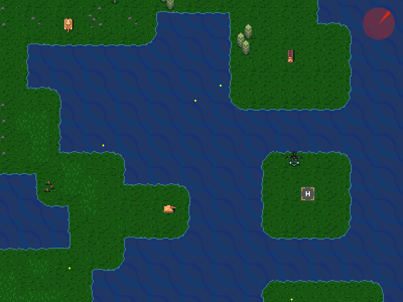

# Game made with SDL2 and Lua

A simple game that I learned in the [Fundamentals of 2D Game Engines with C++ SDL and Lua]( https://www.udemy.com/course/cpp-2d-game-engine/ ) course. In the game i use SDL2 for the game engine, and Lua for data and script loading.

In the future, I plan to create create a map editor for the game, using C ++ and SDL2.

## Dependences
1. [SDL2]( https://www.libsdl.org/ )
2. [Lua]( https://www.lua.org/ )
3. [Sol]( https://github.com/ThePhD/sol2 )
4. [OpenGL Mathematics(GLM)]( https://glm.g-truc.net/0.9.9/index.html )

## Folders
In the folder assets/scripts is the lua files.
In lib folder are the files of GLM and Lua. in the lib/lua folder are de files for Lua and single file sol.